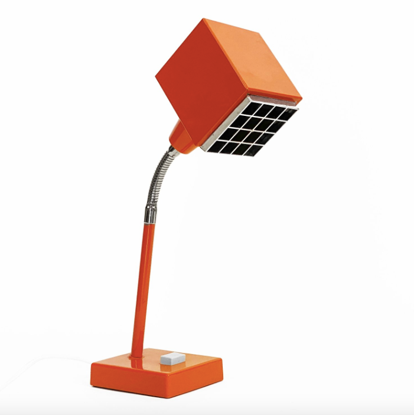
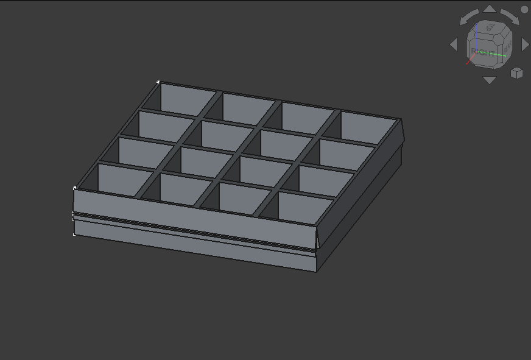

# Elidus Kuben Shade

This repository contains a 3D model, based on the original design by Hans-Agne Jakobsson, of a shade for the [Elidus Kuben](https://auctionet.com/en/4023320-hans-agne-jakobsson-a-1970-s-elidus-kuben-table-lamp) lamp. Most of these lamps, on the second-hand market, are missing the shade.

## Purpose

The purpose of this repository is to provide a resource for restoring the Elidus Kuben lamp to its original form by recreating the missing shade using the 3D model provided.

## Getting Started

To get started with the 3D model:

1. **Download the Model**: Clone this repository or download the model files directly from the repository.
2. **Prepare for Printing**: Ensure you have a 3D printer or access to one. Use slicing software to prepare the model file for printing. Recommended settings and materials will be provided in the repository.
3. **Print the Shade**: Follow the instructions provided in your slicing software and 3D printer manual to print the shade.
4. **Assemble**: Attach the printed shade to your Elidus Kuben lamp following the original design structure.

For more detailed instructions and tips, refer to the documentation included in the repository.

## License

Elidus Kuben Lamp Shade Model © 2025 by DOTAE is licensed under [CC BY 4.0](https://creativecommons.org/licenses/by/4.0/)
